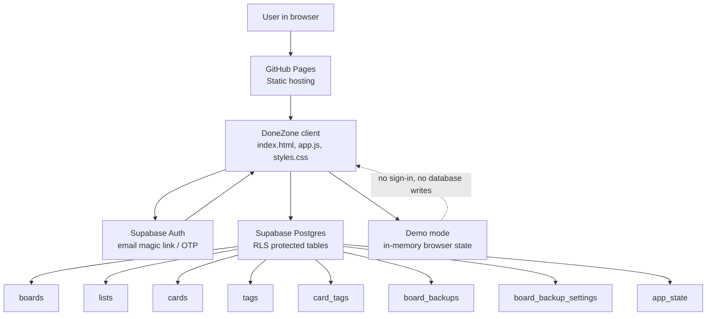

# DoneZone Architecture

DoneZone is a static task-board app hosted on GitHub Pages with Supabase Auth and Supabase Postgres as the hosted backend. It is intentionally simple: the browser owns the UI, Supabase owns authenticated data, and demo mode stays in browser memory.

## Architecture Diagram



## Runtime Components

| Component | Location | Responsibility |
| --- | --- | --- |
| Static shell | `index.html` | Loads the app, Supabase client, styles, and logo. |
| App controller | `src/app.js` | Owns UI rendering, auth flow, board/list/card actions, labels, backups, drag/drop, dark mode, and demo mode. |
| Styles | `src/styles.css` | Defines responsive layout, task board styling, light/dark themes, dialogs, menus, and cards. |
| Supabase client | `src/supabaseClient.js` | Stores the public Supabase URL, publishable browser key, and production redirect URL. |
| Database schema | `supabase/schema.sql` | Creates the Postgres tables, indexes, foreign keys, and `updated_at` triggers. |
| Security policies | `supabase/policies.sql` | Enables row-level security and limits each user to their own rows. |

## Hosting Model

DoneZone is deployed as static files from the GitHub repository:

```text
https://friendly-neighborhood-product-manager.github.io/DoneZone/
```

There is no production server or build step required. GitHub Pages serves the files directly, and the browser talks to Supabase through the public Supabase JavaScript client.

## Authentication Flow

1. The user opens the GitHub Pages URL.
2. `src/app.js` asks Supabase Auth for the current session.
3. If no session exists, the login screen sends a magic link / OTP request.
4. Supabase sends the sign-in email and redirects back to the GitHub Pages URL.
5. Once authenticated, the browser loads the user's boards, lists, cards, labels, backups, backup settings, and app state from Supabase.

## Data Model

| Table | Purpose |
| --- | --- |
| `boards` | Top-level boards owned by a user. |
| `lists` | Board columns such as Next, Doing, and Done. |
| `cards` | Tasks inside lists, including title, comment, due date, done state, archive state, and sort order. |
| `tags` | User-owned labels with names, colors, and order. |
| `card_tags` | Many-to-many link between cards and labels. |
| `board_backups` | JSON snapshots of a board, its lists, cards, labels, and card-label links. |
| `board_backup_settings` | Per-board backup preference settings. |
| `app_state` | Per-user app preferences such as active board and theme. |

All user-owned tables include `user_id`, and row-level security policies restrict access to the authenticated user.

## Primary Data Flows

### Load Workspace

1. Browser gets the Supabase session.
2. If the user is new, starter board/list/card data is created.
3. App loads boards, active board, lists, cards, labels, backups, backup settings, and theme.
4. UI renders from in-memory state.

### Create Or Edit Task

1. User opens the task dialog from `+ New Task`, list `+`, dotted task card, or a task title.
2. App validates title and destination list.
3. App writes the card row to Supabase.
4. App replaces card-label links in `card_tags`.
5. App reloads the workspace and re-renders the board.

### Drag And Drop

1. User drags a card or list.
2. App calculates the destination list/order.
3. App updates `sort_order` and `list_id` in Supabase.
4. App verifies the move, reloads the workspace, and re-renders.

### Demo Mode

Demo mode creates a sample board in browser memory. It does not require Supabase Auth and does not write to Supabase. It is meant for quick product exploration before sign-in.

## Security Notes

- The browser key in `src/supabaseClient.js` is publishable and safe for frontend use.
- Do not commit a Supabase `service_role` key, database password, or direct Postgres connection string.
- Database access depends on Supabase Auth plus row-level security.
- GitHub Pages should be the configured Supabase Auth Site URL and Redirect URL.

## Current Production Shape

```text
Browser
  -> GitHub Pages static app
  -> Supabase Auth for sign-in
  -> Supabase Postgres for persisted task data
  -> Browser memory for demo mode only
```
