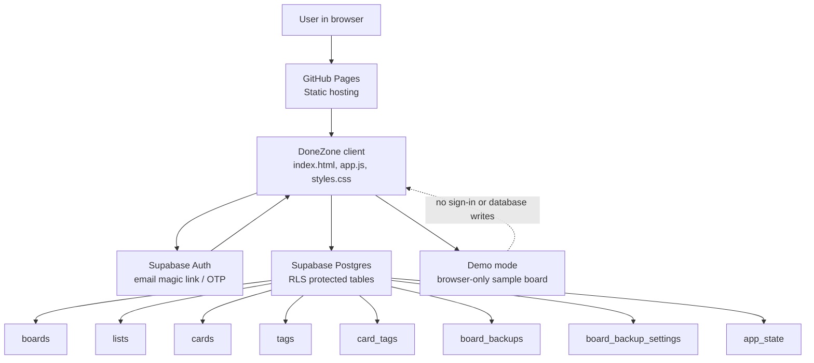

# DoneZone

DoneZone is a lightweight task-board app hosted on GitHub Pages with Supabase Auth and Supabase Postgres as the backend. It is a standalone app with no Oracle-specific branding.

Production URL:

```text
https://friendly-neighborhood-product-manager.github.io/DoneZone/
```

## Architecture



## Current Features

- Email sign-in through Supabase Auth.
- Demo mode so visitors can try the app without signing in.
- Boards, lists, and task cards backed by Supabase Postgres.
- Card and list drag-and-drop.
- Card, list, and board overflow menus for edit, duplicate, move, archive, restore, backup, and delete actions.
- Task editor dialog with title, comments, due date/time, done state, and labels.
- Label management with custom names and colors.
- Clickable card labels that filter the whole board by that label.
- Cards auto-sort by due date/time, with the nearest due items first and undated cards last.
- Due date coloring:
  - Red for overdue.
  - Amber for due in the next 24 hours.
  - Green for due within the next week.
  - Default styling for dates further out.
- Clicking a card due date opens the task editor.
- Board backup, restore, and automatic backup settings.
- Light mode and dark mode.
- Success banners auto-close with countdown text and manual close buttons.

## Stack

- Frontend: static HTML, CSS, and JavaScript
- Hosting: GitHub Pages
- Backend: Supabase Postgres
- Auth: Supabase Auth
- Font: Inter with system fallbacks

## Project Layout

```text
DoneZone/
  index.html
  public/
    donezone-logo.svg
  src/
    app.js
    styles.css
    supabaseClient.js
  supabase/
    schema.sql
    policies.sql
  architecture.md
  donezone-architecture-handdrawn-editable.pptx
  README.md
```

## Runtime Components

| Component | Location | Responsibility |
| --- | --- | --- |
| Static shell | `index.html` | Loads the app, styles, logo, and JavaScript module. |
| App controller | `src/app.js` | Handles rendering, auth, boards, lists, cards, labels, drag/drop, backups, demo mode, themes, and notices. |
| Styles | `src/styles.css` | Defines layout, responsive behavior, dialogs, menus, cards, labels, due-date colors, and light/dark themes. |
| Supabase client | `src/supabaseClient.js` | Stores the public Supabase URL, publishable browser key, and hosted redirect URL. |
| Database schema | `supabase/schema.sql` | Creates the Postgres tables, indexes, foreign keys, and update triggers. |
| Security policies | `supabase/policies.sql` | Enables row-level security and limits each user to their own rows. |

## Supabase Setup

The browser app uses only the Supabase project URL and publishable public key. Never commit a `service_role` key, database password, or direct Postgres connection string.

Supabase Auth should use the GitHub Pages URL:

```text
Site URL: https://friendly-neighborhood-product-manager.github.io/DoneZone/
Redirect URL: https://friendly-neighborhood-product-manager.github.io/DoneZone/
```

The SQL files in `supabase/` are the backend setup files:

1. Run `supabase/schema.sql` in the Supabase SQL editor.
2. Run `supabase/policies.sql` after the schema is created.
3. Confirm row-level security is enabled for user-owned tables.

## Deployment

Publish through GitHub Pages:

1. Commit and push the `DoneZone/` contents to `friendly-neighborhood-product-manager/DoneZone`.
2. In GitHub, open the repository settings.
3. Open Pages.
4. Publish from the `main` branch.
5. Open `https://friendly-neighborhood-product-manager.github.io/DoneZone/`.
6. Sign in with your email. The sign-in link redirects back to GitHub Pages.

## Security Notes

- The Supabase browser key is publishable and safe for frontend use.
- Keep service keys, database passwords, and direct connection strings out of the repo.
- Supabase row-level security protects each user's boards, lists, cards, labels, backups, and app state.
- Demo mode stays in browser memory and does not write to Supabase.

## Related Files

- `architecture.md` contains the fuller technical architecture notes.
- `donezone-architecture-handdrawn-editable.pptx` contains the editable architecture diagram deck.
